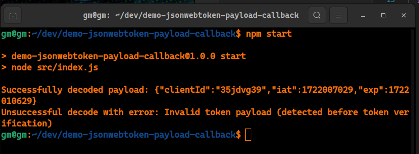

# Checking https://github.com/auth0/node-jsonwebtoken/pull/972

## Setup

1. Clone `https://github.com/georgejmx/node-jsonwebtoken` and checkout to the feature branch there `git checkout 955-payload-schema-validation`
2. Clone this repo into the same parent folder, make sure both repos are next to each other

## Running

```
npm install
npm start
```

Observe the console output


